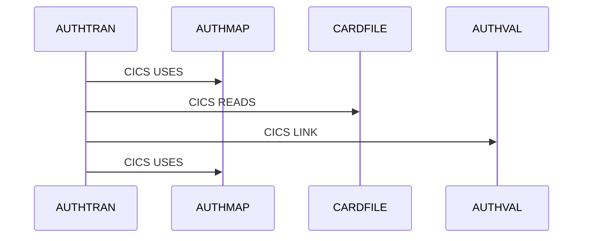

# MIP — The Complete Guide (in plain language, with real outputs)

*One document that explains everything MIP does and how the Claude/Copilot skills and
agents are used — each with a command you can run and the **real output** it produces. No
mainframe background needed. Every output block below was captured from the running system
on the bundled sample estate.*

---

## In five minutes you can do this

Install, then point MIP at a folder of mainframe code:

```bash
$ mip scan ../source_mf_code
Scanned '../source_mf_code' -> mip.db
  artifacts : 24  {'cics': 1, 'cobol': 12, 'copybook': 3, 'db2': 3, 'jcl': 4, 'unknown': 1}
  programs  : 12
  jobs      : 4  (steps: 4)
  edges     : 31  (needs_review: 0, inferred: 1)
```

Now ask it questions in plain English:

```bash
$ mip query "which jobs execute CRDPOST"
DAILYCRD

$ mip query "what does AUTHTRAN call"
CALLS AUTHVAL
```

That's the whole promise in miniature: a pile of code on the left, **answers with proof**
on the right. Everything in this guide is an expansion of those two moments.

## The problem, in one breath

A bank runs **tens of thousands of mainframe programs** written over 40 years. The authors
are retiring; the docs are stale. When someone asks *"where is the credit limit updated?"*
or *"what breaks if we change this table?"*, the honest answer today is *"give us three
weeks and two experts."* **MIP turns that into seconds, with evidence behind every claim.**

## The one big idea

> **Understand the system before you transform it.**

Most tools jump straight to "convert COBOL to Java." MIP builds *understanding* first, layer
by layer, and only then supports change:

```
Source Code → Inventory → Metadata → Knowledge Graph → Reasoning → Copilot → Modernization
```

## The golden rule (this explains everything)

**Every fact MIP states carries evidence and a confidence level. Anything it had to guess is
labelled — never presented as certain.**

- Provable from source → **confirmed** (with a `file:line`).
- Inferred → **`inferred` / `needs_review`** with a confidence score.

You'll see this in the real outputs: a `validation_status` and `confidence` on essentially
every fact. That honesty is the product — it's why a bank can act on the answers.

## Meet the sample estate (used in every example)

A small but realistic **credit-card processing system**. Learn these names once and every
example below clicks:

```
JCL (batch jobs)                COBOL programs                      Online (CICS)
  DAILYCRD → CRDPOST              CRDPOST  card posting driver        AUTHTRAN  auth transaction
  STMTGEN  → STMTDRV               ├ CRDVAL   validation               ├ LINK → AUTHVAL
  PAYPROC  → PAYDRV                └ BALUPD   balance update (DB2)      ├ READ  CARDFILE
  INTCALC  → INTDRV              STMTDRV → STMTFMT  statements          └ SEND  MAP AUTHMAP
                                 PAYDRV  → PAYUPD   payments          CSD: transaction AUTH → AUTHTRAN
  DB2 tables: CARD_MASTER,       INTDRV  → INTCOMP  interest
   ACCT_MASTER, PAYMENT                  ⇢ INTRATE1 (dynamic call)    DEADPROG  (unused — nobody calls it)
  Copybooks: CARDREC, ACCTREC, PAYREC
```

---

# Part 1 — Every functionality (with real output)

Each one: **What it is · Try it · Real output · Why it matters.**

## 1. Discovery & inventory — "what do we even have?"

**What it is.** Walks every file and catalogues it *by reading content*, not file names
(real mainframe members often have no extension).

**Try it.** `mip scan ../source_mf_code`

**Real output.**
```
artifacts : 24  {'cics': 1, 'cobol': 12, 'copybook': 3, 'db2': 3, 'jcl': 4, 'unknown': 1}
programs  : 12     jobs : 4 (steps: 4)     edges : 31  (needs_review: 0, inferred: 1)
```

**Why it matters.** In one pass you know what exists and how much — the foundation for
everything else.

## 2. Adaptive classification — "it learns your folders; nothing is hardcoded"

**What it is.** MIP profiles each folder from its actual contents, so new/renamed folders
just work. Binaries are detected by their bytes, not their names.

**Try it.** `scanner.profile_estate("../source_mf_code")`

**Real output.**
```json
{
  "COBOL":   {"dominant_type": "cobol",    "members": 12, "binary_ratio": 0.0},
  "JCL":     {"dominant_type": "jcl",      "members": 4,  "binary_ratio": 0.0},
  "COPYLIB": {"dominant_type": "copybook", "members": 3,  "binary_ratio": 0.0},
  "DB2":     {"dominant_type": "db2",      "members": 3,  "binary_ratio": 0.0},
  "CICS":    {"dominant_type": "cics",     "members": 1,  "binary_ratio": 0.0},
  "runtime": {"dominant_type": null,       "members": 1,  "binary_ratio": 0.0}
}
```

**Why it matters.** MIP works on *your* estate's real shape and keeps working as it changes
— no brittle hardcoded folder list to maintain.

## 3. Binary-artifact handling — "don't garbage-parse what can't be parsed"

**What it is.** Compiled members (load modules, DBRMs, IMS DBD/PSB, maps) are binary, not
source. MIP detects them by content, inventories them, and skips parsing.

**Real output.** A null-byte file in `LOADLIB/` → `artifact_type: "binary"`, `line_count:
null`, size still recorded, never parsed. (See [`MAINFRAME_ARTIFACTS.md`](MAINFRAME_ARTIFACTS.md)
for the full taxonomy + IMS/MQ scope.)

**Why it matters.** No nonsense extracted from binaries — and a big speed win on real
estates that are full of compiled output.

## 4. Grammar parser & AST — "read code like a compiler, not find-and-replace"

**What it is.** Parses COBOL into a structured tree (divisions, paragraphs, statements). Two
engines ship: a fast **default** parser and an opt-in **ANTLR COBOL-85** backend with full
coverage + real `COPY … REPLACING`. Both pass the identical test suite.

**Real output** (the structure of `CRDPOST`, from its profile):
```json
"structure": {
  "divisions": ["IDENTIFICATION", "DATA", "PROCEDURE"],
  "paragraphs": ["0000-MAIN"],
  "counts": {"CALL": 2, "PERFORM": 0, "IF": 2, "COPY": 1, "EXEC_SQL": 0},
  "complexity": 3
}
```

**Why it matters.** Accurate extraction of calls/copybooks/tables, and a clear path to
production-grade coverage by setting `MIP_PARSER=advanced`.

## 5. Dynamic-call resolution — "catch the calls that hide at runtime"

**What it is.** COBOL can call a program named in a variable (`MOVE 'INTRATE1' TO WS-PGM …
CALL WS-PGM`). MIP follows the value, resolves the target, and marks it **inferred** — kept
and flagged, never dropped or asserted.

**Try it.** `GET /api/program/INTDRV/profile`

**Real output.**
```json
"dependencies": [
  {"rel_type":"CALLS","target_id":"INTCOMP",  "validation_status":"confirmed","confidence":1.0},
  {"rel_type":"CALLS","target_id":"INTRATE1", "validation_status":"inferred", "confidence":0.7},
  {"rel_type":"USES", "target_id":"ACCTREC",  "validation_status":"confirmed","confidence":1.0}
]
```

**Why it matters.** The call graph includes the dangerous, easy-to-miss edges — `INTRATE1`
is there, honestly labelled 70% confidence instead of silently lost.

## 6. Knowledge graph — "how the system actually fits together"

**What it is.** Every program/job/table/copybook/screen/queue is a node; every
CALL/EXECUTE/READ/WRITE/USE is an edge. The graph view adds **insights** on top.

**Try it.** `GET /api/graph` → `insights`

**Real output.**
```json
{
  "node_count": 17, "edge_count": 11,
  "roots": ["AUTHTRAN","CRDPOST","INTDRV","PAYDRV","STMTDRV"],
  "dead": ["DEADPROG"],
  "dynamic_edges": [{"source":"INTDRV","target":"INTRATE1"}],
  "community_count": 3, "modularity": 0.367
}
```

**Why it matters.** One navigable map underpins impact analysis, root detection, lineage,
and clustering.

## 7. Root / driver detection — "where does work actually start?"

**What it is.** Finds true entry points — batch (`EXEC PGM=` in jobs) **and online** (CICS
transactions) — so online programs aren't mistaken for dead code.

**Try it.** `mip roots`

**Real output.**
```
Root / driver programs:
  - AUTHTRAN     (online — entered via CICS transaction AUTH)
  - CRDPOST  - STMTDRV  - PAYDRV  - INTDRV   (batch — each run by a job)
```

**Why it matters.** The handful of programs that start everything — your entry points for
understanding or modernising.

## 8. Dead-code detection — "what can we safely retire?"

**What it is.** Programs no job runs and nothing calls — flagged for review, never
auto-deleted.

**Try it.** `mip dead`

**Real output.**
```
Dead-code candidates (needs_review - may be invoked dynamically/externally):
  - DEADPROG
```

**Why it matters.** A removal shortlist with the honesty to say "verify first."

## 9. Impact analysis / blast radius — "what breaks if I change this?"

**What it is.** For any program/table/field, computes everything affected upstream and
relied-on downstream, with a confidence-weighted score.

**Try it.** `GET /api/program/CARD_MASTER/impact`

**Real output.**
```json
{
  "target": "CARD_MASTER", "target_kind": "db2_table", "blast_radius_score": 5.0,
  "impacted": [
    {"id":"BALUPD","kind":"program","distance":1,"confidence":1.0},
    {"id":"STMTDRV","kind":"program","distance":1,"confidence":1.0},
    {"id":"CRDPOST","kind":"program","distance":2,"confidence":1.0},
    {"id":"STMTGEN","kind":"job","distance":2,"confidence":1.0},
    {"id":"DAILYCRD","kind":"job","distance":3,"confidence":1.0}
  ], "review": []
}
```

**Why it matters.** Before touching `CARD_MASTER` you see all 5 things that ride on it — and
that two are whole *jobs*. Change risk you estimate, not discover in production.

## 10. Criticality ranking (PageRank) — "which programs matter most?"

**What it is.** Ranks programs by how central they are (the algorithm Google used for web
pages), surfacing the highest-leverage components.

**Real output** (`insights.critical_by_pagerank`): `STMTFMT 0.097`, `PAYUPD 0.097`,
`INTDRV / PAYDRV / CRDPOST 0.070` …

**Why it matters.** A prioritised "if this fails, a lot fails" list for risk reviews and
modernization order. (Runtime data sharpens this further — see §15.)

## 11. Business capabilities & communities — "group tech by what the business does"

**What it is.** Clusters the estate into capabilities two ways — by naming + call-closure,
and by **Louvain community detection** on the dependency graph. Both **inferred**, scored.

**Try it.** `GET /api/communities`

**Real output.**
```json
{ "modularity": 0.367, "communities": [
  {"id":0,"label":"Authorization / Validation","members":["AUTHTRAN","AUTHVAL","CRDPOST","CRDVAL","DEADPROG","STMTDRV","STMTFMT"],"validation_status":"inferred"},
  {"id":1,"label":"Interest / Balance","members":["BALUPD","INTCOMP","INTDRV","INTRATE1"],"validation_status":"inferred"},
  {"id":2,"label":"Payment / Update","members":["PAYDRV","PAYUPD"],"validation_status":"inferred"} ]}
```

**Why it matters.** Organise modernization around business areas. Note the honesty: `BALUPD`
landed in *Interest/Balance*, not *Card*, because it shares the `ACCTREC` copybook — **real
hidden coupling MIP surfaces** — and every grouping is flagged `inferred`, review me.

## 12. Data lineage — "where does this data come from and go?"

**What it is.** Traces data at table level and **field level** (COBOL field ↔ DB2 column via
SQL host variables, `MOVE`, `COMPUTE`).

**Try it.** `GET /api/program/STMTDRV/lineage` and `…/PAYUPD/lineage`

**Real output.**
```json
STMTDRV: CARD_MASTER.CURRENT_BALANCE → CARD-BALANCE   [sql-read]   (COBOL/STMTDRV:12)
         CARD_MASTER.CARD_NUMBER     → CARD-NUMBER     [sql-read]   (COBOL/STMTDRV:12)
PAYUPD : PAY-AMOUNT                  → PAYMENT.PAY_AMOUNT [sql-write] (COBOL/PAYUPD:11)
```

**Why it matters.** Answer "where is X updated?" and trace a value end-to-end — vital for
compliance and safe change. Each flow cites its source line.

## 13. Business-rule extraction — "pull the policy out of the code"

**What it is.** Finds `IF`/`EVALUATE` decisions and `COMPUTE` calculations and renders them
as rule cards: the condition + source line (confirmed) and a plain-English statement
(inferred, so a human verifies the *meaning*).

**Try it.** `GET /api/program/CRDVAL/rules`

**Real output.**
```json
{ "id":"CRDVAL-R001", "kind":"validation",
  "condition":"CARD-STATUS = 'A'",
  "statement":"When CARD-STATUS is equal to 'A', then move 0 to lk-return-code.",
  "source_evidence":"COBOL/CRDVAL:13", "confidence":0.6, "validation_status":"inferred" }
```
(`INTCOMP` yields a `calculation`: *"Set ACCT-BALANCE to ACCT-BALANCE * 1.015."*)

**Why it matters.** Decades of buried policy become a reviewable list — the highest-value
knowledge to recover before any rewrite — with the source line to confirm each one.

## 14. Online layer (CICS) + transaction mapping — "see the screens and online calls too"

**What it is.** Reads `EXEC CICS` (online LINKs, file/queue access, screen maps) and CICS
**CSD** definitions mapping a transaction to its entry program — so the online world is in
the graph, not just batch.

**Try it.** `GET /api/program/AUTHTRAN/sequence` (also drives §18)

**Real output** (participants + messages):
```
AUTHTRAN → AUTHMAP : CICS USES   (screen)
AUTHTRAN → CARDFILE: CICS READS  (file)
AUTHTRAN → AUTHVAL : CICS LINK   (online program call)
```
…and the CSD gives `transaction AUTH → starts AUTHTRAN`.

**Why it matters.** Online transaction flows — invisible to batch-only tools — become
first-class in the graph, lineage, and impact.

## 15. Runtime-evidence correlation — "cross-check the code against what actually ran"

**What it is.** Feed it operational data (how often things ran); it reconciles static
analysis with runtime reality and raises/lowers confidence accordingly.

**Try it.** `GET /api/runtime`

**Real output** (window `2026-05`, source *SMF type-30 + CICS monitor*):
```
DAILYCRD ran 31×, PAYPROC 21×, STMTGEN 1× — all "confirmed-at-runtime"
reconciliation: confirmed_dead = 1 (DEADPROG: 0 runs, static+runtime agree)
                static_miss    = 1 (INTRATE1 ran → the resolved dynamic CALL really fires)
```

**Why it matters.** Higher-confidence dead-code and criticality, and proof that the
resolved dynamic call is real. Where no runtime data exists, MIP says "unknown" — it never
fabricates.

## 16. Natural-language Query Console — "ask in English, see the reasoning, keep the receipt"

**What it is.** Ask in plain English; MIP answers from the graph (facts, not a chatbot's
imagination), **shows its work**, and logs every Q&A to `question_log.md`.

**Try it.** `POST /api/query {"question":"which jobs execute CRDPOST"}`

**Real output.**
```json
{ "result": ["DAILYCRD"],
  "trace": {
    "thought_process": [
      "Parsed the question and routed it to intent: \"jobs_executing\".",
      "Identified the program token: CRDPOST.",
      "Looked up job_step rows whose EXEC PGM= names this program (EXECUTES edges)." ],
    "evidence": [{"source_id":"DAILYCRD","rel_type":"EXECUTES","target_id":"CRDPOST",
                  "source_evidence":"JCL/DAILYCRD:5","validation_status":"confirmed"}],
    "reason": "CRDPOST is named in EXEC PGM= of 1 job step; a confirmed EXECUTES edge traced to JCL source." }}
```

**Why it matters.** Anyone — analyst, auditor, new joiner — gets a trustworthy answer *and*
the transparent, logged rationale behind it.

## 17. Global search — "find anything across the estate"

**What it is.** One search box over programs, jobs, tables, copybooks, transactions, and
capabilities, ranked by relevance.

**Try it.** `GET /api/search?q=AUTH`

**Real output.**
```json
[ {"kind":"transaction","id":"AUTH","score":100},
  {"kind":"capability","id":"Authorization","score":50},
  {"kind":"program","id":"AUTHTRAN","detail":"COBOL program (27 lines)","score":50},
  {"kind":"program","id":"AUTHVAL","score":50} ]
```

**Why it matters.** Instant navigation across a 180k-file estate — exact matches rank first.

## 18. Sequence diagrams — "auto-draw how a transaction flows"

**What it is.** From the call/SQL/CICS order in the code, MIP emits a **Mermaid sequence
diagram** of a program's runtime interactions — documentation derived from the code itself.

**Real output** (the actual Mermaid for `AUTHTRAN`, rendered in the web app):


**Why it matters.** Living documentation that always matches the code — the antidote to
"our diagrams are 10 years stale."

## 19. Export — "own your data; open it anywhere"

**What it is.** Export inventory + graph as **JSON, CSV, or GraphML** with one click/call.

**Real output.** `GET /api/export?format=graphml` returns `application/xml` starting
`<graphml …>` (opens in Gephi / imports to Neo4j); `format=csv&kind=programs` returns a
spreadsheet whose header is `program_id,language,line_count,calls_out,called_by,is_root,is_dead`.

**Why it matters.** No lock-in — feed MIP's knowledge into whatever the team already uses.

## 20. Scale & performance — "built for 180,000 files"

**What it is.** Reads only a 64 KB header per file to classify, skips binaries fast, writes
to SQLite in **batched transactions (≈4.6× faster)**, and **parses across all CPU cores**
in parallel — with results identical to single-threaded.

**Try it.** `MIP_WORKERS=8 mip scan <big-estate>`

**Why it matters.** Enterprise-scale scanning that finishes in reasonable time, with an
honest written plan for when to graduate SQLite/NetworkX to a graph DB
([`00-foundation/ARCHITECTURE.md`](../00-foundation/ARCHITECTURE.md)).

## 21. The web application — "all of the above, in a browser"

**What it is.** A clean, Apple-style React app: Dashboard, Programs (search/sort/filter),
Capabilities, Jobs, an interactive **Call Graph** (zoom/pan, confidence slider, edge
filters, keyboard + screen-reader friendly), Roots, Dead Code, Query Console, Q&A Log —
plus per-program **profile, AST, impact, lineage diagram, sequence diagram, business
rules**, **click-to-evidence** everywhere, and one-click **export**.

**Why it matters.** A product an analyst uses without training; every screen leads with
value and shows its evidence. (Screen-by-screen tour: [`app/USER_MANUAL.md`](../app/USER_MANUAL.md).)

## 22. The evidence & confidence model — "the thread through all of it"

**What it is.** Not a button — the discipline behind every output. Each fact carries source,
method, confidence, validation status, timestamp. You've seen it in every block above:
`confirmed` vs `inferred`, a `confidence`, a `file:line`.

**Why it matters.** Trust. A bank can make decisions on MIP because MIP is honest about what
it knows and what it's guessing.

---

# Part 2 — How Claude / Copilot skills and agents are used

"Agents and skills" appear in two senses: (A) skills/agents that are part of MIP, and (B)
the Claude Code agents that *built* MIP. Both, with examples.

## A. MIP skills — the "job descriptions" the AI follows

In [`03-skills/`](../03-skills/) there are **12 skills**, each a folder with a `SKILL.md` in
the open **Agent Skills standard** ([agentskills.io](https://agentskills.io/specification)).
A skill is a *persona with a charter* — it makes the AI behave consistently, like giving
each role a clear job description.

| Skill | In plain words |
|-------|----------------|
| `mainframe-code-analyst` | Reads raw code, extracts the facts (calls, copybooks, tables, AST). |
| `metadata-modeler` | Defines the shared vocabulary (what a "Program" / "Job" is). |
| `sqlite-engineer` | Designs how facts are stored and queried. |
| `graph-engineer` | Builds the graph; runs impact, PageRank, communities. |
| `business-capability-analyst` | Groups technical assets into business capabilities. |
| `resilience-engineer` | Finds single points of failure, dead code, operational risk. |
| `security-compliance-analyst` | Flags PII / financial / regulatory data and impact. |
| `mainframe-modernization-architect` | Turns understanding into a safe, staged plan. |
| `test-engineer` | Keeps everything tested and trustworthy. |
| `code-reviewer` | Critiques designs/code for correctness and honesty. |
| `documentation-writer` | Writes the docs (like this one). |
| `repository-engineer` | Keeps repo + skills/prompts organised. |

**Example.** Analysing a program flows through skills like a team handoff:
`mainframe-code-analyst` (extract) → `metadata-modeler` (normalise) → `graph-engineer`
(connect) → `business-capability-analyst` (group). The registry
[`skills.catalog.json`](../03-skills/skills.catalog.json) maps each skill → its prompts →
its code, and **`python 03-skills/validate_catalog.py`** fails if they ever drift apart.

**Outcome.** Consistent AI behaviour and a clear line from *who's responsible* (skill) →
*what they're told* (prompt) → *the code that does it* (tool).

## B. The prompt library — the "questions" that drive the skills

[`04-prompts/`](../04-prompts/) holds curated prompts (discovery, parsing, metadata, graph)
plus community modernization prompts ("explain this program", "extract business rules",
"draft the Java", "plan the strangler migration"). Each names its owning skill and bakes in
the evidence-and-confidence rule (e.g. *"cite source lines; mark anything uncertain"*).

**Outcome.** Anyone on the team gets consistent, safe results from Copilot/Claude instead of
ad-hoc prompting.

## C. Project agents — Claude Code helpers that ship with the repo

[`.claude/agents/`](../.claude/agents/) defines two ready agents (and `.claude/skills/`
mirrors the 12 skills so Claude Code auto-discovers them):

- **`mip-discovery`** — *"Analyse `source_mf_code`"* → runs the engine and reports
  inventory, roots, dead code, the capability map, and blast-radius examples, each with
  evidence + confidence.
- **`mip-modernization-architect`** — *"What should we modernise first?"* → uses the
  evidence to recommend the lowest-blast-radius capability first and sequences the rest,
  citing the numbers.

**The query trace above (§16) is exactly what "the AI shows its work" looks like** — intent,
steps, evidence, reason — and it's logged for audit.

## D. How agents *built* MIP — multi-agent orchestration (with examples)

MIP was built by **fanning out parallel Claude Code subagents**, each owning a
non-overlapping set of files, then integrating + verifying centrally:

- **Parallel feature pairs.** business-rule extraction (backend) ‖ router+search (frontend);
  ANTLR parser ‖ runtime correlation; scan-performance ‖ binary classification. Each agent
  got exact API contracts so halves matched on first integration.
- **An adversarial code-review agent.** *Real example:* it caught that `ADD A TO B GIVING C`
  was inventing a phantom data field from the keyword `TO`. **Four** such correctness/honesty
  bugs were found and fixed with regression tests *before* shipping.
- **A documentation agent.** Generated [`docs/showcase/`](showcase/) from **real** captured
  output — no invented numbers (same discipline as this guide).
- **Guardrails on every agent.** Don't fabricate; keep the default parser the verified
  reference; keep the suite green; commit only verified work.

**Outcome.** Faster delivery *and* higher quality — independent agents build in parallel, an
independent agent tries to break the result, only verified work lands.

## E. How it all connects

```
04-prompts (what to ask) → 03-skills (who does it, by what rules) → reference-implementation (code that runs)
                              ↑ registry + validator keep these in sync ↑
.claude/agents + .claude/skills → make all of the above usable from Claude Code in this repo
```

---

# Part 3 — A day in the life (one story, real outputs)

> *"We need to change how the balance is stored in `CARD_MASTER`. Is that safe?"*

**1. Find it** — `search "CARD"` → `CARD_MASTER` (DB2 table), plus the `Card Posting`
capability and `CARDREC` copybook.

**2. Blast radius** — `impact CARD_MASTER`:
```
impacted: BALUPD, STMTDRV, CRDPOST, STMTGEN(job), DAILYCRD(job)   score 5.0
```
Not local — two whole jobs ride on it.

**3. Field lineage** — `lineage`:
```
BALUPD : ACCT-BALANCE → CARD_MASTER.CURRENT_BALANCE   [writes]
STMTDRV: CARD_MASTER.CURRENT_BALANCE → CARD-BALANCE    [reads]
```
Exactly which fields move, with source lines.

**4. Business rules** — `rules CRDVAL` → *"When CARD-STATUS = 'A', then move 0 to
lk-return-code"* (COBOL/CRDVAL:13). The policy, with proof.

**5. Runtime** — `runtime` → all impacted programs ran this month (not dead): the change
must be coordinated across live jobs.

**6. Picture it** — the `AUTHTRAN` sequence diagram (§18) style, generated for the posting
flow, to share in the change review.

**Three weeks and two SMEs → fifteen minutes, with evidence for every claim.** That is MIP.

---

# Part 4 — Why you can trust it

- **84 automated tests pass**, including a ground-truth corpus that pins precision/recall to
  **1.0** on the sample estate, and a test that *enforces* the honesty rules (dynamic calls
  stay `inferred`, never `confirmed`).
- The **advanced ANTLR COBOL-85 backend** is parity-tested against the default parser (28
  more tests) — `/api/health` confirms it's available:
  ```json
  "parser": {"requested":"default","advanced_available":true,"effective":"default"}
  ```
- **Every output above is real**, captured from the running system — and every fact carries
  its evidence and confidence.

## Honest limits & roadmap
The default parser is a focused grammar; `MIP_PARSER=advanced` adds full COBOL-85 +
`COPY REPLACING`. Inferred outputs (capabilities, communities, rule meaning, resolved
dynamic calls) are confidence-scored and flagged — by design. **Next:** IMS/MQ extraction, a
graph-DB/scale backend, multi-tenant ([`../COMPARISON_AND_ROADMAP.md`](../COMPARISON_AND_ROADMAP.md)).

---

# Part 5 — Quick reference

Run one line at a time. Windows PowerShell 5.1 doesn't support `&&`.

```
# setup (from the repo root)
cd reference-implementation
uv venv --python 3.13
uv pip install -e ".[dev,api]"

# engine (from reference-implementation)
uv run mip scan ../source_mf_code
uv run mip query "which jobs execute CRDPOST"
uv run mip roots
uv run mip dead

# web app  → http://localhost:8000
cd ../app/frontend
npm install
npm run build
cd ../../reference-implementation
uv run uvicorn mip.api:app --port 8000

# prove it (from reference-implementation)
uv run pytest -q                              # 90 passing
uv run python ../03-skills/validate_catalog.py   # skills ⇄ catalog in sync

# knobs — set before the command that uses them
# PowerShell:  $env:MIP_PARSER="advanced"     bash/zsh:  MIP_PARSER=advanced uv run ...
#   MIP_SOURCE   MIP_PARSER=advanced   MIP_WORKERS=8   MIP_BINARY_LIBS=ACMELOAD
```

*Go deeper: [`README.md`](../README.md) (run/test) · [`app/USER_MANUAL.md`](../app/USER_MANUAL.md)
(every screen) · [`docs/showcase/`](showcase/) (management samples) ·
[`00-foundation/`](../00-foundation/) (philosophy, principles, architecture).*

---

*You've reached the end. If MIP scanned your estate, you'd now have: a full inventory, the
true entry points, a dependency graph you can query in English, field-level lineage,
extracted business rules, blast-radius for any change, and a modernization order — each
answer carrying its own evidence. That's the difference between *hoping* you understand a
40-year-old system and *knowing* you do.*
