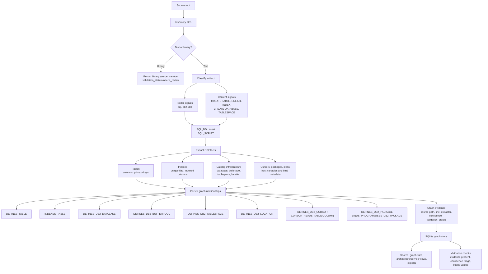

# MIP Enterprise Intelligence Setup

This guide explains how to set up the application on another machine, point it at
a mainframe source-code folder, scan it into SQLite, and explore the results in
the CLI and React UI.

## What This Build Does

- Uses a vendored ANTLR4 COBOL parser generated from COBOL85 grammar files.
- Uses SLL-first / LL-fallback ANTLR parsing and avoids duplicate preprocessing.
- Supports local process-based parsing with parent-process SQLite cache writes.
- Enforces parser hard timeouts when `parse_timeout_seconds` is configured.
- Expands `COPY ... REPLACING` when copybooks are resolved.
- Stores source members, assets, relationships, evidence, parser metadata, graph
  summaries, graph-slice cache, and parser-result cache in SQLite.
- Supports extensionless source files by using folder signals, content signals,
  and referenced-member promotion for copybooks.
- Persists scan progress, scan issues, validation results, and schema-version
  metadata for production governance.
- Persists scan telemetry, slow-file timing, inventory-cache reuse, correction
  feedback, and ground-truth scorecard results.
- Extracts DB2 DDL/catalog infrastructure, DCLGEN-style declarations, CICS
  resources, IMS DBD/PSB/PCB facts, and VSAM file-control metadata.
- Extracts DB2 cursor, package, and plan facts, including cursor table/column
  usage, predicate columns, host variables, open/fetch/close operations, and
  BIND PACKAGE/PLAN relationships.
- Extracts COBOL data semantics, field lineage, paragraph control flow,
  CALL USING contracts, LINKAGE SECTION contracts, CICS data contracts, and JCL
  step-level execution/data edges.
- Expands JCL PROCs with symbolic parameters, handles continued EXEC/PROC/DD
  cards, captures IF/ELSE/ENDIF and COND conditions, and persists expanded
  step/dataset edges.
- Creates copybook field ownership nodes so shared copybook fields can be traced
  back from program fields.
- Supports configured copybook search order and records duplicate/candidate
  conflicts in copy-resolution metadata.
- Creates DB2 statement and host-variable nodes with statement-level table,
  column, predicate, and host-variable binding edges.
- Classifies and extracts confidence-scored static facts from extensionless
  PL/I and assembler members.
- Builds bounded graph views instead of trying to render a full enterprise graph
  in the browser.
- Provides node coverage reports so developers can see what was captured,
  inferred, unresolved, or not observed for a selected program.
- Captures phase 7-10 production facts as graph nodes/edges: DCLGEN/table
  links, DB2 join columns, CICS contracts, file I/O operation semantics, business
  rules, transformations, statement ordering, SORT/MERGE, JCL DD bindings, GDG,
  and return-code condition flow.
- Produces graph-derived bounded contexts, service candidates, and modernization
  roadmap work packages with feedback gates and evidence citations.
- Keeps confidence and validation status on assets, relationships, and evidence.
- Excludes `.git` folders during discovery and records skipped directory counts.
- Exposes graph-native `nodes` and `edges` terminology while keeping legacy
  `assets` and `relationships` aliases for compatibility.

See `IMPLEMENTATION_LOGIC.md` for the exact data-only parsing, insight,
clustering, feedback-loop, and export logic.

## DB2 DDL/Catalog Extraction Flow



Quick DB2 check:

```powershell
python -m mip_intel.cli --db data\db2-ddl-check.db analyze F:\mip\mip_structure\_tmp_bankdemo\sources\sql --config "{run_id:db2-ddl-check,batch_size:10,max_workers:2}"
python -m mip_intel.cli --db data\db2-ddl-check.db stats --run-id db2-ddl-check
python -m mip_intel.cli --db data\db2-ddl-check.db search BNKCUST --run-id db2-ddl-check
python -m mip_intel.cli --db data\db2-ddl-check.db search DBNASE --run-id db2-ddl-check
python -m unittest tests.test_phase2_parser_coverage.Phase2ParserCoverageTests.test_db2_ddl_defines_tables_indexes_and_columns -v
python -m unittest tests.test_enterprise_deep_parser_models.EnterpriseDeepParserModelTests.test_db2_cursor_package_and_plan_model_are_graph_facts -v
python -m unittest tests.test_enterprise_deep_parser_models.EnterpriseDeepParserModelTests.test_jcl_proc_expansion_conditions_and_symbolic_datasets -v
python -m unittest tests.test_phase7_10_complete_intelligence -v
```

This is a production-direction implementation. It is not yet the final enterprise
platform for every dialect and every mainframe product. The next production waves
should add distributed workers, tenant isolation, PostgreSQL storage, richer
PL/I and assembler parsers, runtime evidence ingestion, and authenticated API/UI
deployment.

## Prerequisites

- Python 3.11 or later.
- Node.js 18 or later.
- Git, if you want to clone public test estates.
- Enough disk for SQLite DBs, parser cache, graph exports, and source bundles.

## Install Backend

From the application folder:

```powershell
cd F:\mip\mip_structure\intelligent_platform\mip-enterprise-intelligence

python -m venv .venv
.\.venv\Scripts\Activate.ps1
python -m pip install --upgrade pip
python -m pip install -e ".[api,dev]"
```

Verify the backend:

```powershell
python -m unittest discover -s tests -v
python -m coverage run -m unittest discover -s tests
python -m coverage report
```

## Install Frontend

```powershell
cd F:\mip\mip_structure\intelligent_platform\mip-enterprise-intelligence\frontend
npm install
npm run build
```

## Analyze Your Source Code

Use any source root. The source can contain files with extensions or no
extensions. Binary files are inventoried but not parsed.

```powershell
cd F:\mip\mip_structure\intelligent_platform\mip-enterprise-intelligence
.\.venv\Scripts\Activate.ps1

python -m mip_intel.cli --db data\my-estate.db analyze "F:\path\to\source_code"
```

Large scan options:

```powershell
python -m mip_intel.cli --db data\my-estate.db analyze "F:\path\to\source_code" --config "{run_id:nightly-001,batch_size:500,max_workers:4,parse_timeout_seconds:60,resume:false}"
```

Production scan options with incremental cache and copybook search order:

```powershell
python -m mip_intel.cli --db data\my-estate.db analyze "F:\path\to\source_code" --config "{run_id:nightly-002,batch_size:1000,max_workers:6,parse_timeout_seconds:60,incremental:true,collect_telemetry:true,copybook_dirs:copylib;shared/copybooks;app/cpy}"
```

Useful checks after scan:

```powershell
python -m mip_intel.cli --db data\my-estate.db stats
python -m mip_intel.cli --db data\my-estate.db performance --limit 25
python -m mip_intel.cli --db data\my-estate.db validate
python -m mip_intel.cli --db data\my-estate.db roots --limit 50
python -m mip_intel.cli --db data\my-estate.db clusters --limit 50
python -m mip_intel.cli --db data\my-estate.db search CUST --limit 20
python -m mip_intel.cli --db data\my-estate.db nodes --scope roots --limit 50
python -m mip_intel.cli --db data\my-estate.db nodes --scope normal_programs --limit 50
python -m mip_intel.cli --db data\my-estate.db coverage CUST001
python -m mip_intel.cli --db data\my-estate.db domains --limit 20
python -m mip_intel.cli --db data\my-estate.db service-candidates --limit 20
python -m mip_intel.cli --db data\my-estate.db roadmap --limit 20
```

Correction feedback loop:

```powershell
python -m mip_intel.cli --db data\my-estate.db correction-add --entity-kind MEMBER --selector shared/CARDREC --action CLASSIFY_AS --corrected-type COPYBOOK --corrected-status confirmed --corrected-confidence 0.99 --reason "Known copybook"
python -m mip_intel.cli --db data\my-estate.db corrections
python -m mip_intel.cli --db data\my-estate.db analyze "F:\path\to\source_code" --config "{run_id:nightly-003,incremental:true}"
```

Ground-truth scorecard:

```powershell
python -m mip_intel.cli --db data\my-estate.db scorecard F:\path\to\scorecard.json --run-id nightly-003
python -m mip_intel.cli --db data\my-estate.db scorecards --run-id nightly-003
```

Minimal scorecard JSON:

```json
{
  "name": "card-demo-known-facts",
  "expected_members": [{"path": "app/cbl/CRDPOST", "artifact_type": "COBOL"}],
  "expected_nodes": [{"type": "PROGRAM", "name": "CRDPOST"}],
  "expected_edges": [{"type": "CALLS", "source": "CRDPOST", "target": "CRDVAL"}],
  "forbidden_edges": [{"type": "CALLS", "source": "CRDPOST", "target": "WRONG"}]
}
```

Inspect a program:

```powershell
python -m mip_intel.cli --db data\my-estate.db graph-slice --root CUST001 --direction downstream --depth 2 --limit 500
python -m mip_intel.cli --db data\my-estate.db graph-slice --root CUST001 --direction upstream --depth 2 --limit 500
python -m mip_intel.cli --db data\my-estate.db call-graph CUST001 --direction both --depth 8
python -m mip_intel.cli --db data\my-estate.db dependency-graph CUST001 --direction both --depth 4
python -m mip_intel.cli --db data\my-estate.db coverage CUST001
python -m mip_intel.cli --db data\my-estate.db ast-tree CUST001
python -m mip_intel.cli --db data\my-estate.db required-files CUST001 --depth 8
```

Useful deep-model searches after a scan:

```powershell
python -m mip_intel.cli --db data\my-estate.db stats
python -m mip_intel.cli --db data\my-estate.db search CARDRUN --limit 20
python -m mip_intel.cli --db data\my-estate.db search CARDBILL --limit 20
python -m mip_intel.cli --db data\my-estate.db graph-slice --root CARDRUN --direction downstream --depth 3 --limit 500 --relationship-types INVOKES_PROC,EXPANDS_TO_STEP,EXPANDED_FROM_PROC_STEP,CONTROLS_STEP
python -m mip_intel.cli --db data\my-estate.db graph-slice --root CARDBILL --direction both --depth 3 --limit 500 --relationship-types DEFINES_DB2_CURSOR,CURSOR_READS_TABLE,CURSOR_READS_COLUMN,FETCHES_DB2_CURSOR,DEFINES_DB2_STATEMENT,STATEMENT_READS_TABLE,STATEMENT_READS_COLUMN,HOST_VARIABLE_BINDS_COLUMN
python -m mip_intel.cli --db data\my-estate.db graph-slice --root CUST001 --direction both --depth 4 --limit 800 --relationship-types DEFINES_BUSINESS_RULE,RULE_USES_FIELD,DEFINES_TRANSFORMATION,TRANSFORMATION_INPUT_FIELD,TRANSFORMATION_OUTPUT_FIELD,CONTAINS_STATEMENT,EXECUTES_BEFORE,DEFINES_FILE_IO,HAS_RECORD_LAYOUT,RECORD_DECLARES_FIELD,DEFINES_SORT_MERGE
python -m mip_intel.cli --db data\my-estate.db graph-slice --root CARDRUN --direction both --depth 4 --limit 800 --relationship-types DECLARES_DD,BINDS_DATASET,CONDITION_REFERENCES_STEP,CONDITION_CHECKS_RETURN_CODE,READS_DATASET,WRITES_DATASET
python -m mip_intel.cli --db data\my-estate.db graph-slice --root CARDCICS --direction both --depth 4 --limit 800 --relationship-types DEFINES_CICS_CONTRACT,CONTRACT_USES_FIELD,HANDLES_CICS_CONDITION,BRANCHES_TO
```

Export a reverse-engineering bundle:

```powershell
python -m mip_intel.cli --db data\my-estate.db export-bundle CUST001 --output data\bundles\CUST001
```

The bundle contains manifest JSON, source files, AST data, evidence, relationships,
and minimal context for reverse-engineering documentation or modernization tools.

Export graph facts:

```powershell
python -m mip_intel.cli --db data\my-estate.db export --format json --limit 5000 --output data\exports\graph.json
```

JSON exports include `nodes`, `edges`, legacy aliases `assets` and
`relationships`, plus a manifest with row limits, total counts, truncation flags,
storage backend, terminology mapping, and checksum.

## Run API And React UI

Terminal 1, backend API:

```powershell
cd F:\mip\mip_structure\intelligent_platform\mip-enterprise-intelligence
.\.venv\Scripts\Activate.ps1
python -m mip_intel.cli --db data\my-estate.db serve --host 127.0.0.1 --port 8000
```

Terminal 2, React UI:

```powershell
cd F:\mip\mip_structure\intelligent_platform\mip-enterprise-intelligence\frontend
npm run dev
```

Open:

```text
http://127.0.0.1:5174
```

If backend port `8000` is busy, start backend on another port:

```powershell
python -m mip_intel.cli --db data\my-estate.db serve --host 127.0.0.1 --port 8010
```

Then start frontend with:

```powershell
$env:VITE_API_PROXY_TARGET='http://127.0.0.1:8010'
npm run dev
```

Important UI rule: the React app renders bounded graph slices and focused flow
diagrams, not the full enterprise graph. Use search, roots, clusters, dependency
matrices, coverage reports, and architecture views to navigate large estates.

## Public Test Estate: BankDemo

BankDemo is useful because it includes COBOL, copybooks, BMS, JCL, PROC, PL/I,
assembler, SQL DDL, CSD, data files, scripts, and executable/runtime folders.

Clone it:

```powershell
cd F:\mip\mip_structure
git clone --depth 1 --branch develop https://github.com/RocketSoftwareCOBOLandMainframe/BankDemo.git _tmp_bankdemo
```

Recommended first scan, source only:

```powershell
cd F:\mip\mip_structure\intelligent_platform\mip-enterprise-intelligence
.\.venv\Scripts\Activate.ps1
python -m mip_intel.cli --db data\bankdemo-sources.db analyze F:\mip\mip_structure\_tmp_bankdemo\sources
python -m mip_intel.cli --db data\bankdemo-sources.db validate
python -m mip_intel.cli --db data\bankdemo-sources.db roots --limit 50
python -m mip_intel.cli --db data\bankdemo-sources.db clusters --limit 50
```

Broader validation scan, whole repo:

```powershell
python -m mip_intel.cli --db data\bankdemo-full.db analyze F:\mip\mip_structure\_tmp_bankdemo
python -m mip_intel.cli --db data\bankdemo-full.db stats
python -m mip_intel.cli --db data\bankdemo-full.db validate
```

Use the source-only scan for parser quality. Use the full-repo scan to validate
inventory behavior across scripts, data files, executable folders, and project
metadata.

## Reading Confidence And Validation

- `confirmed`: directly observed in source or parser output.
- `inferred`: likely, but based on content/folder signals or deterministic inference.
- `needs_review`: incomplete or unresolved, such as dynamic calls or missing copybooks.

Confidence is a numeric score from `0.0` to `1.0`. Do not treat low-confidence
facts as final modernization decisions. Use them to guide review.

Parser metadata appears under asset attributes:

```json
{
  "parser": {
    "effective": "local-antlr4-full-grammar",
    "confidence": 0.95,
    "validation_status": "confirmed",
    "cache_hit": false
  }
}
```

If `effective` is a fallback parser mode, downstream relationships are capped by
the parser confidence.

Validation is persisted in SQLite:

```powershell
python -m mip_intel.cli --db data\my-estate.db validate
```

The checks cover evidence presence, visible review gaps, confidence ranges,
allowed validation statuses, and evidence line ranges.

## Storage And Migration Readiness

- SQLite is the v1 backend and records schema version in `schema_version`.
- Repository interfaces isolate most graph reads and writes from the API layer.
- `mip_intel.storage.create_repository()` is the storage factory.
- PostgreSQL is intentionally not faked; selecting a PostgreSQL DSN raises a
  clear `NotImplementedError` until the real adapter is implemented.

## Current Production Gaps

- True incremental scan is not complete yet. Parser cache skips unchanged parse
  work, but the scanner still walks and hashes source files.
- Streaming batch persistence is still needed to keep peak memory proportional
  to batch size on very large estates.
- Distributed worker orchestration is still needed beyond local process workers.
- DB2 extraction now captures DDL, DCLGEN, cursors, host variables, packages,
  plans, joins, and statement-level usage; the next step is a normalized SQL
  catalog with referential constraints and dialect-specific SQL validation.
- JCL extraction now captures PROC expansion, symbolic substitution, DD/GDG
  bindings, COND, IF/ELSE, and return-code flow; the next step is a fuller JCL
  grammar for scheduler-specific extensions and enterprise standards.
- Copybook field ownership is represented as graph facts; the next step is
  dialect-aware copybook expansion for nested REDEFINES/OCCURS and cross-program
  ownership reconciliation at very large scale.
- PL/I and assembler are classified with static facts today, but need deeper
  production parsers for control/data flow comparable to COBOL.
- Runtime/scheduler evidence should be ingested and reconciled with static graph facts.
- Authentication, authorization, tenant isolation, and audit trails are needed
  before enterprise deployment.
- LLM explanations should remain grounded in SQLite evidence and should never
  replace parser facts.
